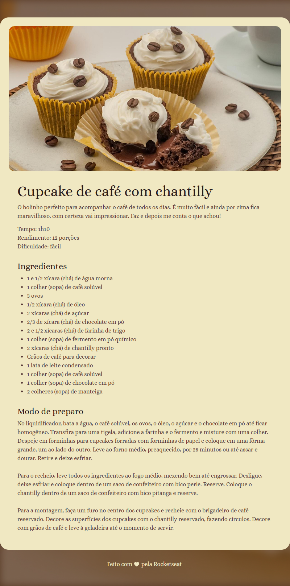

# Página de Receita

Este é um projeto simples de uma página de receita criada com HTML e CSS, para fins de estudo, aprendizado e prática. A receita apresentada é de um delicioso cupcake de café com chantilly. O design da página utiliza fontes personalizadas do Google Fonts.

## Tecnologias Utilizadas
- **HTML5**: Estrutura da página e organização do conteúdo.
- **CSS3**: Estilização da página, incluindo cores, espaçamento e fontes.
- **Google Fonts**: Fonte "Alice" para melhor visual.

## Estrutura do Projeto
O projeto contém os seguintes arquivos principais:
- **index.html**: Contém o conteúdo da receita, incluindo ingredientes e modo de preparo.
- **styles.css**: Arquivo de estilos para a página, incluindo configuração de cores, fontes e layout.
- **assets/**: Pasta que armazena imagens usadas na página, como o fundo, a imagem do cupcake e o ícone de coração no rodapé, além da captura de tela da página.

## Como Visualizar o Projeto
1. Clone este repositório:
   ```bash
   git clone https://github.com/Dandiels/projeto-pagina-de-receita.git
   ```
2. Abra o arquivo `index.html` em um navegador web.

## Captura de Tela


## Créditos
Projeto inspirado e desenvolvido com referência aos materiais da **Rocketseat**.